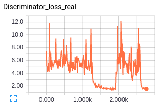
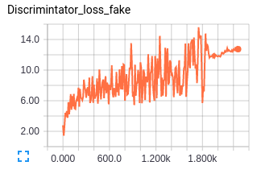
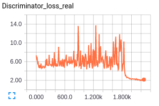
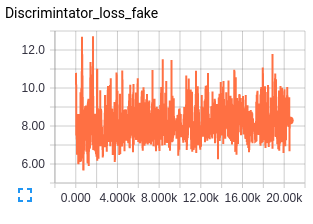

# EBGAN.tensorflow
Tensorflow implementation of [Energy Based Generative Adversarial Networks (EBGAN)](http://arxiv.org/pdf/1609.03126v2.pdf).

- [Results](#results)
- [Observations](#observations)
- [References](#references)

*Disclaimer: Still experimenting with higher resolution GAN* :confused: *and the repo is still under edit ...*

##Results
Randomly generated images - no cherry picking here:exclamation: 

Both results are after 8 epochs - will update results for longer epochs later.

**With Pull Away Loss term**

**Without Pull Away Loss term**

##Observations
- Setting up a energy based objective did not make training GAN easier or any better by my observation. I felt the same way after reading the paper as well - The idea of using energy was the only novel idea that was presented, the comparitive results, details on the experimentation all seemed weak.
- In fact with margin values, I had no idea how my model was doing looking at the loss term - original GAN had a nice probablistic interpretation.
- Also the model seemed to collapse suddenly and what was more interesting was it was able to recover later - this was suprising but this doesn't really mean we can train GANs in a easier manner.
- The margin term introduced in the loss was important to avoid the GAN from collapsing. I believe the folks who wrote the paper started with low margin and went in steps of 10 to avoid model failure. The loss value of the discriminator fake when the model collapses also helps in choosing the margin.
- One more thing the intoduction of margin does is, it doesn't allow the autoencoder to achieve zero reconstruction loss which can be noticed with the imperfections in the decoded image.
- Pull away term with weight 0.1 seems to affect the model minimally. 

**Failed Attempts**

- Low Margin values and very low learning rate results in model failure

    

    

**Successful Attempts**

- Results for without pullaway term and with pull away term. (The graphs seem a lot different because of the y-scale)

    

